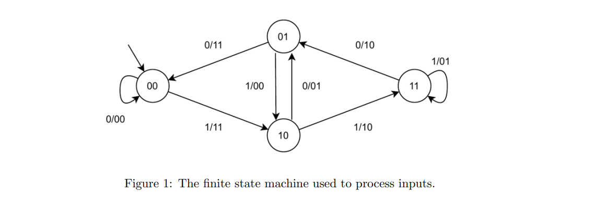
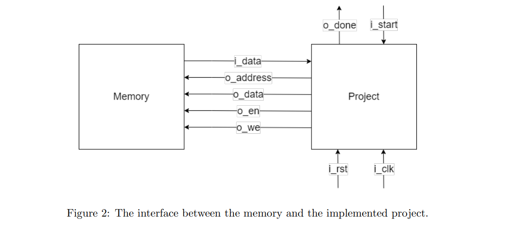
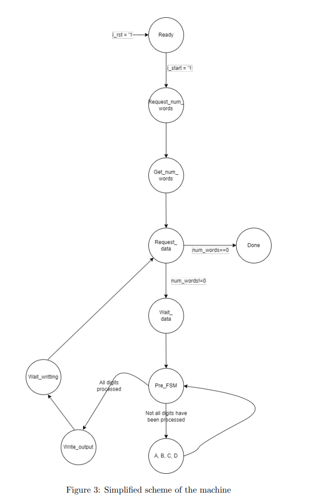
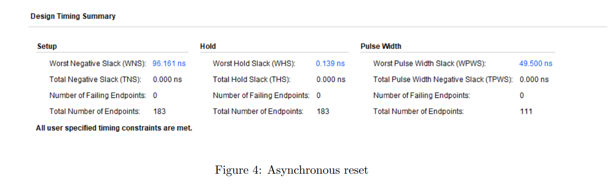
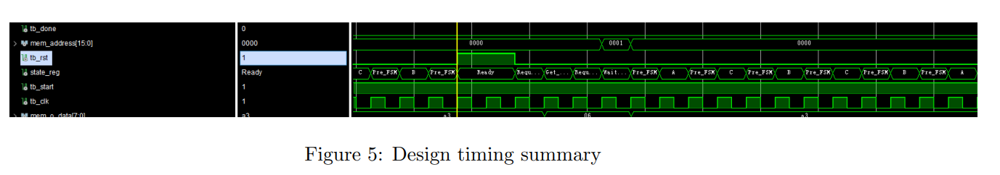

## 1 Introduction

The project implemented a hardware module that interacts with a memory in VHDL. The module
takes one byte at a time as input from the memory, then processes it in a way shown in figure 1
starting from the most significant bit of the input. After one byte is completely processed, it writes
the 2-byte result on the memory. For example, let’s say the input is 10100010, then the output should
be 11010001 11001101. If there is any other input data, it continues to read and process them as
described above.

## 2 Architecture

## 2.1 Interface of component

Figure 2 shows how components interact with each other, in particular:

- iclk is the CLOCK signal.
- irst is the RESET signal.
- istart starts the machine when it equals to 1.
- idata is the vector signal read from memory after a request of reading.
- oaddress is the vector signal sends the intended reading/writing address to the memory. The
    address 0 contains the number of input bytes, the input bytes are restored starting from address 1
    continuously. The results should be written on address 1000 and afterward without interruption.
- odone is the signal that represents the end of elaboration and that all results have been written
    into memory.
- oen is the ENABLE signal that enables the communication with memory.
- owe is the WRITE ENABLE signal that has to be set to 1 when writing into memory.
- odata is the data to be written into memory.

### 2.2 Implementation

When istart is set to 1, the machine starts elaboration fromReadystate. Once the elaboration
ended, it sets odone to 1 and stays atDonestate until istart goes down to 0 which will take it back
toReadystate. Furthermore, the irst signal will reset the machine to its default state.

2.2.1 States of the machine

- Ready: This is the initial state of the machine. It waits until istart turns to 1, then it sets up
    output signals to read the number of words from address 0.
- Requestnumwords: It waits for the response of memory.
- Getnumwords: It memorizes the information returned from memory into a register.
- Requestdata: If numwords acquired in the Getnumwords stage is 0, it sets next state as
    Done. Otherwise, it manages to request 1 byte of data from memory.
- Waitdata: It waits for the response of memory.
- PreFSM: This is the last state before the machine enters the FSM described in Figure 1. It
    extracts the digit out of the byte and pass it as input to the FSM, sets up output mask. For
    example, if the machine is dealing with the most significant bit of the byte, then the output
    mask is 1100000000000000, if the machine is dealing with the least significant bit, the output
    mask is 0000000000000011. If all 8 bits of the byte have been processed, it goes to the state of
    writeoutput.
- A, B, C, D: These states perform in the same way as the FSM in Figure 1. They also set up
    output according to the output mask. In the end, they set up the machine to return to PreFSM
    state.
- Writeoutput: It writes the 1st part of the result into memory.
- Waitwriting: It writes the 2nd part of the result into memory. And head back to Requestdata
    state.
- Done: This is the final state of the machine.

2.2.2 Processes

The implemented project has two processes.

1. The first process manages register transfer and asynchronous reset.
2. The second process represents the machine that analyzes input signals along with the current
    state, and determines where the system is going to evolve.

## 3 Experimental Results

### 3.1 Synthesis result

According to the synthesis report provided by Vivado, the design used 99 LUTs and 110 registers as
flip flops, and 0 latches.

### 3.2 Test results

To verify the correct behavior of the project, a test suite has been provided. The following behaviors
have been tested in pre-synthesis and post-synthesis:

1. Given 0 byte as input, the machine did not write anything into memory.
2. Given 1 byte as input, the machine wrote the correct results into memory.
3. Given 2 bytes as input, the machine wrote the correct results into memory.
4. Given 2 bytes as input, the machine wrote the correct results into memory 2 times without
    resetting the machine.
5. Given 2 bytes as input, repeat the procedure 3 times, the machine wrote the correct results into
    3 different memories.
6. Given 255 bytes as input, the machine wrote the correct results into memory.
7. Reset the machine 15 clock period after istart turned 1, the machine wrote the correct results
    into memory.
8. Repeat test 6 three times, the machine wrote the correct results into 3 different memories.
9. Asynchronous reset: reset 10.5 clock period after istart turned 1, the stagereg changed to Ready
    the machine wrote the correct results into memory. Furthermore, the design timing summary is
    provided below.

